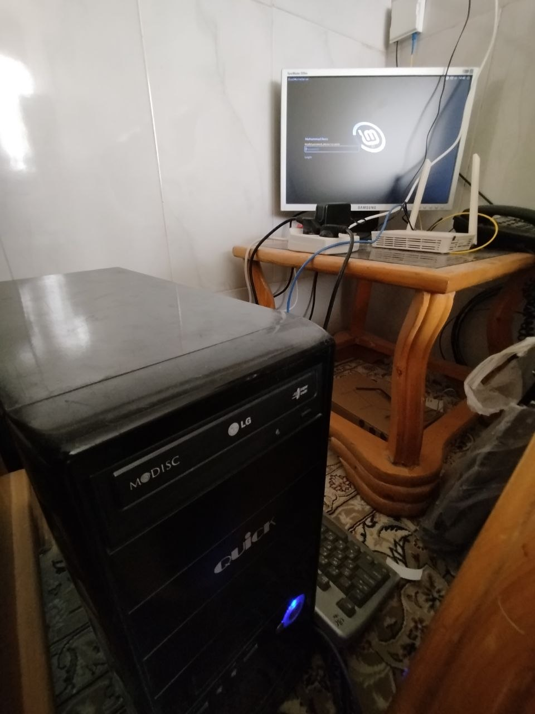

# QR-GEN / 01

```
CLIENT-SIDE QR CODE GENERATOR // LOCAL TOOL
```

**→ [qr.ebad84.ir](https://qr.ebad84.ir)**

---

## // WHAT

A minimal QR code generator that runs entirely in the browser.  
No backend. No API. No tracking. Your data never leaves your device.

```
USER INPUT → BROWSER JS → QR ENCODER → CANVAS → DOWNLOAD
```

Supports: `URL` `TEXT` `EMAIL` `PHONE` `WIFI`  
Output: `PNG` `SVG`

---

## // STACK

```
html + css + vanilla js
qrcodejs          — client-side QR encoding
jetbrains mono    — embedded, no google fonts
nginx             — served from my old PC at home
```

---

## // SELF-HOSTED

This runs on an old PC I turned into a home server.  
Not a cloud VPS. Not a managed host. Just old hardware, a public IP, and nginx.



---

## // DEPLOY

```bash
git clone https://github.com/ebad84/qr.ebad84.ir /var/www/qr.ebad84.ir
ln -s /var/www/qr.ebad84.ir/nginx/qr.ebad84.ir /etc/nginx/sites-available/qr.ebad84.ir
ln -s /etc/nginx/sites-available/qr.ebad84.ir /etc/nginx/sites-enabled/
nginx -t && systemctl reload nginx
# then: certbot --nginx -d qr.ebad84.ir
```

**update:**
```bash
cd /var/www/qr.ebad84.ir && git pull
```

---

## // LICENSE

This project is published under MIT license . Boil it, mix it, Do whatever you want

---

```
ebad84.ir // another small tool
```
